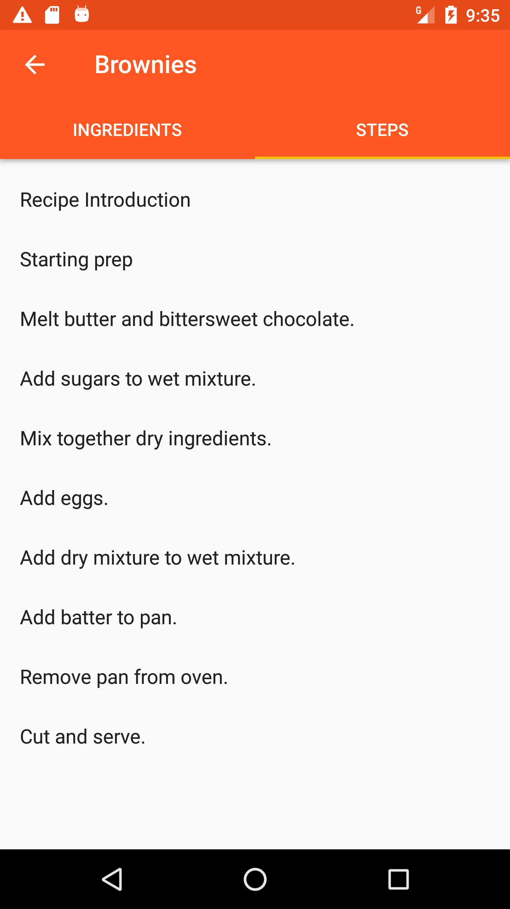

# YaBaking

Concept application that lists recipes and support users on the cooking process displaying ingredients and steps.

This application was created as an exercise for the Udacity Android Nanodegree program.

If you just want to give it a try download the test apk [here](https://drive.google.com/open?id=0BxuNaEVyDit0S2RHcUZfbTA3V1k).

## Table of Contents
* [Showcase](#showcase)
* [Feature List](#features)
* [Tools and Libs](#tools)
* [TODOs](#todos)

## Showcase

  
  
  
  
  
  
  
  

## Feature List

* Recipes Listing from Udacity Data Source.
* Recipe Ingredients and Steps Visualization.
* Recipe Step by Step Navigation.
* Step video or image displaying.
* Recipe Ingredients Widget.
* Offline support for recipe information.
* Tablet layout for Recipe navigation.
* Fullscreen landscape layout for step video watching.

## Tools and Libs

* [Timber](https://github.com/JakeWharton/timber)
* [Exoplayer](http://google.github.io/ExoPlayer/)
* [DbFlow](https://github.com/Raizlabs/DBFlow)
* [RxJava2](https://github.com/ReactiveX/RxJava)
* [RxIdler](https://github.com/square/RxIdler)
* [Retrofit2](http://square.github.io/retrofit/)
* [Picasso](http://square.github.io/picasso/)
* [Gson](https://github.com/google/gson)
* [AutoValues](https://github.com/google/auto/tree/master/value)
* [Butterknife](http://jakewharton.github.io/butterknife/)
* [Dagger2](https://google.github.io/dagger/)
* [Android Support Libs](https://developer.android.com/topic/libraries/support-library/index.html): 
  * RecyclerView
  * CardView
  * Design Support Library
  * ConstraintLayout
* [Android Testing Support Libs](https://developer.android.com/training/testing/index.html)

## ToDos

* Improve error messages displayed to the user.
* Unit Testes 
* Improve Instrumented Tests.
* Animations

License
-------

    Copyright 2017 Eduardo Carrara de Araujo

    Licensed under the Apache License, Version 2.0 (the "License");
    you may not use this file except in compliance with the License.
    You may obtain a copy of the License at

       http://www.apache.org/licenses/LICENSE-2.0

    Unless required by applicable law or agreed to in writing, software
    distributed under the License is distributed on an "AS IS" BASIS,
    WITHOUT WARRANTIES OR CONDITIONS OF ANY KIND, either express or implied.
    See the License for the specific language governing permissions and
    limitations under the License.
